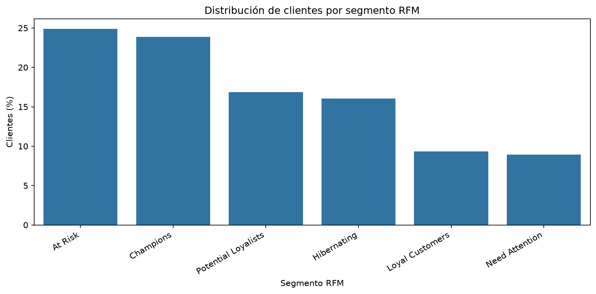
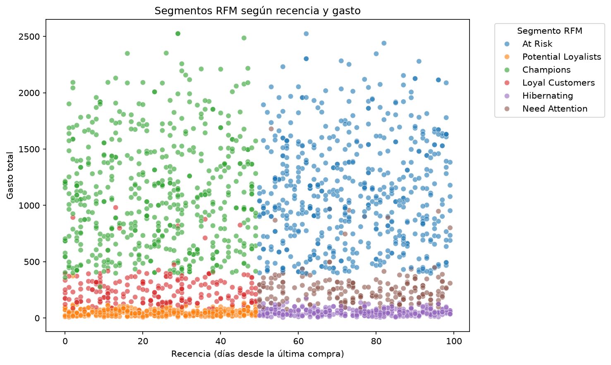
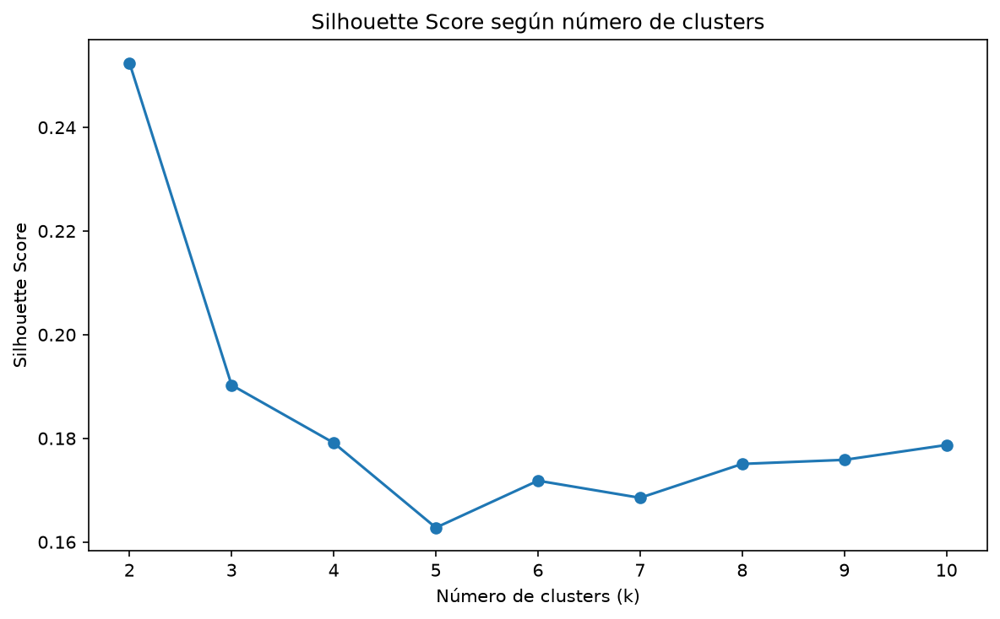
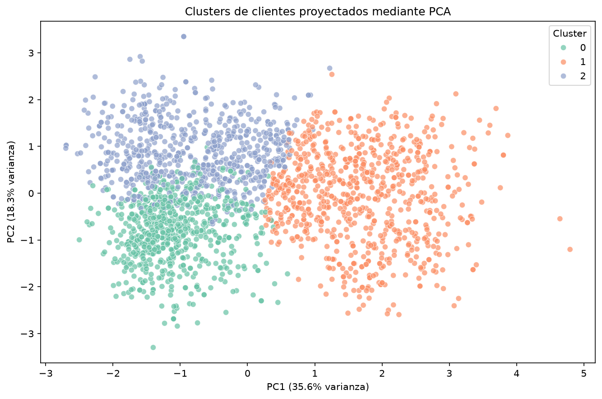
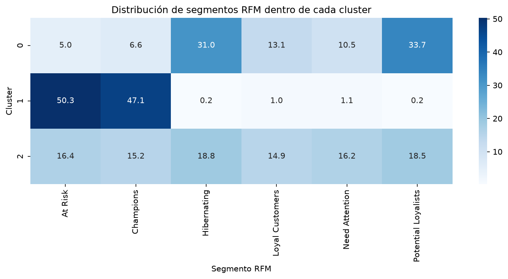

# Customer Segmentation & Marketing Analytics

Proyecto de segmentación de clientes que combina **análisis exploratorio de datos, segmentación RFM y clustering mediante K-Means** para identificar perfiles de cliente interpretables y traducirlos en hipótesis de marketing accionables.

El análisis estudia características sociodemográficas, comportamiento de compra, gasto por producto, utilización de canales y respuesta a campañas de marketing mediante dos enfoques complementarios:

- **Segmentación RFM**, para analizar la relación comercial del cliente a partir de Recency, Frequency y Monetary Value.
- **K-Means**, para identificar perfiles multidimensionales a partir de características demográficas, económicas y de comportamiento.

La combinación de ambas metodologías permite obtener una visión más completa de la base de clientes.

---

## Problema de negocio

Una base de clientes no es homogénea. Los consumidores presentan diferencias en valor económico, comportamiento de compra, características demográficas, nivel de actividad y respuesta a las acciones de marketing.

Este proyecto busca responder cuatro preguntas principales:

1. ¿Qué patrones demográficos y de comportamiento existen entre los clientes?
2. ¿Qué clientes presentan mayor valor y actividad comercial?
3. ¿Es posible identificar perfiles de cliente interpretables mediante aprendizaje no supervisado?
4. ¿Cómo pueden utilizarse estos perfiles para plantear estrategias de marketing diferenciadas?

El análisis tiene carácter descriptivo y exploratorio. Por ello, las recomendaciones finales se plantean como **hipótesis de negocio que deberían validarse experimentalmente**, y no como relaciones causales demostradas.

---

## Dataset

El proyecto utiliza el dataset **Customer Personality Analysis**, disponible en Kaggle.

El dataset original contiene:

- **2.240 clientes**
- **29 variables**
- Información sociodemográfica
- Gasto por categorías de producto
- Compras por distintos canales
- Actividad web
- Uso de promociones
- Respuesta a campañas de marketing

El dataset está publicado en Kaggle bajo licencia **CC0: Public Domain** y reconoce a Dr. Omar Romero-Hernandez como proveedor de los datos.

### Calidad de los datos

Durante el análisis y preparación se identificaron varios aspectos relevantes:

- 24 valores ausentes en `Income`.
- Tres años de nacimiento especialmente antiguos: 1893, 1899 y 1900.
- Un valor extremo de `Income` de 666.666.
- Dos variables constantes: `Z_CostContact` y `Z_Revenue`.

Los ingresos ausentes se imputaron utilizando la mediana de `Income` dentro de cada nivel educativo.

Las observaciones potencialmente anómalas para las que no existía evidencia suficiente de un valor correcto se conservaron, evitando introducir correcciones arbitrarias.

También se crearon seis variables analíticas:

`Age`, `CustomerTenure`, `Children`, `TotalSpend`, `TotalPurchases` y `CampaignAcceptances`.

El dataset preparado contiene finalmente **2.240 registros y 33 variables**, sin valores ausentes ni registros duplicados.

---

## Metodología

El proyecto sigue seis etapas:

1. **Data Understanding**  
   Estructura del dataset, tipos de datos, valores ausentes, cardinalidad y detección inicial de anomalías.

2. **Exploratory Data Analysis**  
   Análisis demográfico, patrones de gasto, canales de compra, actividad digital y respuesta a campañas.

3. **Data Preparation**  
   Tratamiento de valores ausentes, feature engineering y construcción del dataset analítico.

4. **RFM Segmentation**  
   Segmentación según Recency, Frequency y Monetary Value.

5. **K-Means Segmentation**  
   Clustering no supervisado utilizando variables demográficas y de comportamiento estandarizadas.

6. **Customer Profiling & Marketing Insights**  
   Interpretación de los clusters, comparación con RFM y formulación de hipótesis de marketing.

---

## Análisis exploratorio

El EDA muestra diferencias importantes en el gasto y comportamiento de compra de los clientes.

Las distribuciones de gasto presentan asimetría positiva, con una parte de los clientes alcanzando niveles de consumo considerablemente superiores al resto.

Las tiendas físicas presentan el mayor número medio de compras, seguidas por el canal web y el catálogo.

Por otra parte, el número de visitas mensuales a la web presenta una asociación prácticamente nula con las compras online:

- Pearson: **-0,056**
- Spearman: **-0,097**

Una mayor frecuencia de visitas no implica, por tanto, una mayor actividad de compra online.

La respuesta a la última campaña alcanza aproximadamente el **14,9%**. Los clientes que respondieron presentan mayores niveles medios de ingresos y gasto, aunque estas relaciones son descriptivas y no permiten establecer causalidad.

---

## Segmentación RFM

RFM analiza a los clientes mediante tres dimensiones:

- **Recency:** tiempo transcurrido desde la última compra.
- **Frequency:** frecuencia de compra.
- **Monetary:** gasto acumulado.

Cada dimensión recibió una puntuación de 1 a 4. Posteriormente, las combinaciones obtenidas se agruparon en seis segmentos interpretables.

| Segmento | Clientes | % |
|---|---:|---:|
| At Risk | 558 | 24,91% |
| Champions | 535 | 23,88% |
| Potential Loyalists | 378 | 16,88% |
| Hibernating | 360 | 16,07% |
| Loyal Customers | 209 | 9,33% |
| Need Attention | 200 | 8,93% |



`TotalPurchases` y `TotalSpend` presentan una correlación de Spearman de aproximadamente **0,91**, mostrando una relación muy fuerte entre frecuencia de compra y valor monetario.

Recency aporta una dimensión adicional que permite distinguir clientes con un valor histórico similar pero con diferente nivel de actividad reciente.



---

## Segmentación mediante K-Means

Para construir la segmentación K-Means se utilizaron seis variables:

- `Age`
- `Income`
- `Children`
- `CustomerTenure`
- `Recency`
- `TotalSpend`

`TotalPurchases` se excluyó debido a su elevada relación con `TotalSpend`, evitando introducir información altamente redundante en el espacio de clustering.

Antes del entrenamiento se excluyeron únicamente de la muestra utilizada por K-Means cuatro observaciones extremas:

- Tres clientes con edades superiores a 100 años.
- Un cliente con ingresos de 666.666.

Estas observaciones permanecieron intactas en el dataset preparado original.

### Selección del número de clusters

Se evaluaron soluciones entre **k = 2 y k = 10** utilizando inercia y Silhouette Score.



`k = 2` obtuvo el mayor Silhouette Score, aproximadamente **0,252**, mientras que `k = 3` obtuvo aproximadamente **0,190**.

Finalmente se seleccionó **k = 3** porque proporcionaba una granularidad adicional útil para interpretar distintos perfiles de cliente, mantenía tamaños de cluster equilibrados y presentaba una elevada estabilidad frente a diferentes inicializaciones.

La solución `k = 3` obtuvo un **Adjusted Rand Index de 1,0** en todas las comparaciones realizadas entre diferentes semillas.

Esta estabilidad demuestra consistencia frente a la inicialización del algoritmo, pero no implica que existan tres grupos naturales perfectamente separados. El Silhouette Score relativamente moderado indica que existe solapamiento entre los perfiles.

---

## Visualización mediante PCA

Principal Component Analysis se utilizó exclusivamente como herramienta de visualización y **no para entrenar K-Means**.

Las dos primeras componentes explican:

- PC1: **35,61%**
- PC2: **18,28%**
- Varianza acumulada: **53,89%**

PC1 está relacionada principalmente con el valor económico, especialmente gasto e ingresos, mientras que PC2 presenta una mayor relación con características demográficas como la edad.



La representación muestra una separación económica más clara del cluster de mayor valor, mientras que los otros dos grupos presentan un mayor solapamiento.

Dado que las dos primeras componentes representan únicamente el 53,89% de la varianza total estandarizada, la proyección no debe interpretarse como una representación completa de la geometría del clustering.

---

## Perfiles de cliente

La solución final identifica tres perfiles.

### Cluster 0 — Young Low-Value Customers

- **715 clientes**
- Edad media: **36,9 años**
- Ingresos medios: **31.945**
- Gasto medio: **151**
- Compras medias: **7,0**
- Hijos medios: **0,84**
- Respuesta a la última campaña: **11,0%**

Es el grupo más joven y presenta los menores niveles de ingresos y gasto.

Su composición RFM contiene grupos relevantes tanto de `Potential Loyalists` como de `Hibernating`, mostrando diferentes niveles de actividad reciente dentro de un perfil estructural similar.

### Cluster 1 — High-Value Customers

- **803 clientes**
- Edad media: **46,5 años**
- Ingresos medios: **73.388**
- Gasto medio: **1.286**
- Compras medias: **19,6**
- Hijos medios: **0,40**
- Respuesta a la última campaña: **24,0%**

Es el perfil de mayor valor económico, con niveles claramente superiores de ingresos, gasto y actividad de compra.

Sin embargo, su composición RFM revela una diferencia importante: aproximadamente la mitad pertenece a `At Risk`, mientras que una parte muy relevante corresponde a `Champions`.

El valor económico por sí solo no permite conocer el estado actual de la relación con el cliente.

### Cluster 2 — Family-Oriented Moderate-Value Customers

- **718 clientes**
- Edad media: **51,7 años**
- Ingresos medios: **47.918**
- Gasto medio: **299**
- Compras medias: **10,2**
- Hijos medios: **1,67**
- Respuesta a la última campaña: **8,6%**

Es el grupo de mayor edad y con mayor número medio de hijos.

Su composición RFM es considerablemente más heterogénea, por lo que resulta especialmente útil incorporar información adicional sobre el estado reciente de cada cliente.

---

## Combinación de K-Means y RFM

Ambas metodologías responden a preguntas diferentes.

**K-Means** identifica perfiles multidimensionales utilizando características demográficas, económicas y de comportamiento.

**RFM** describe el estado de la relación comercial utilizando recencia, frecuencia y gasto.

Su combinación proporciona más información que cualquiera de los dos enfoques de forma independiente.



Un ejemplo especialmente relevante aparece en `High-Value Customers`, donde conviven grandes grupos de `Champions` y `At Risk`.

Estos clientes presentan características económicas similares, pero niveles de actividad reciente muy diferentes, lo que puede justificar estrategias de marketing distintas.

---

## Recomendaciones de marketing

### Young Low-Value Customers

Priorizar estrategias de **activación e incremento de frecuencia**.

Pueden explorarse promociones selectivas y acciones digitales, diferenciando especialmente entre `Potential Loyalists` recientes y clientes `Hibernating`.

### High-Value Customers

Priorizar **retención, fidelización y cross-selling**.

La segmentación RFM permite diferenciar `Champions` activos de clientes de alto valor clasificados como `At Risk`, evitando aplicar una estrategia única a todo el cluster.

### Family-Oriented Moderate-Value Customers

Explorar estrategias orientadas al **incremento de cesta y diversificación de categorías**.

Pueden evaluarse bundles, cross-selling entre productos y promociones segmentadas, utilizando RFM como una capa adicional de priorización.

> Estas recomendaciones constituyen hipótesis derivadas del análisis descriptivo. Su efectividad debería validarse mediante experimentos controlados o tests A/B antes de atribuir efectos causales.

---

## Conclusiones

La segmentación de clientes se beneficia de combinar diferentes perspectivas analíticas.

RFM proporciona una visión compacta del valor y actividad reciente del cliente, mientras que K-Means identifica patrones más amplios relacionados con características económicas, demográficas y de comportamiento.

El análisis identifica tres perfiles interpretables, pero también demuestra que clientes pertenecientes al mismo perfil estructural pueden encontrarse en estados RFM muy diferentes.

La combinación de **perfil de cliente + estado de la relación comercial** permite generar hipótesis de marketing más específicas y potencialmente más accionables.

---

## Estructura del proyecto

```text
customer-segmentation-analysis/
├── data/
│   ├── raw/
│   └── processed/
├── notebooks/
│   ├── 01_data_understanding.ipynb
│   ├── 02_eda.ipynb
│   ├── 03_data_preparation.ipynb
│   ├── 04_rfm_segmentation.ipynb
│   ├── 05_kmeans_segmentation.ipynb
│   └── 06_customer_profiling_&_marketing_insights.ipynb
├── reports/
│   └── figures/
├── results/
│   └── key_insights.md
├── requirements.in
├── requirements.txt
├── LICENSE
└── README.md